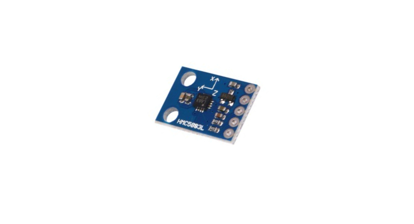

# GY-271 Compass Magnetometer Setup

This repository contains code and instructions for setting up the GY-271 compass magnetometer module with an Arduino microcontroller. The code provided enables you to read and interpret magnetic field data from the GY-271 module, allowing you to use it as a compass or for other applications that require magnetometer functionality. To get a more comprehensive guide on how to set up the module, please refer to our [Find Your Way With a GY-271 Compass Module and Arduino](https://www.makeuseof.com/arduino-gy-271-hmc5883l-compass-magnetometer/) article.

If you have any questions, issues, or contributions, feel free to raise them on the GitHub repository. Happy magnetometer tinkering!

## License

This code is open source and available under the [MIT License](LICENSE).

---

**Note:** This README assumes basic familiarity with Arduino programming and magnetometer concepts.
