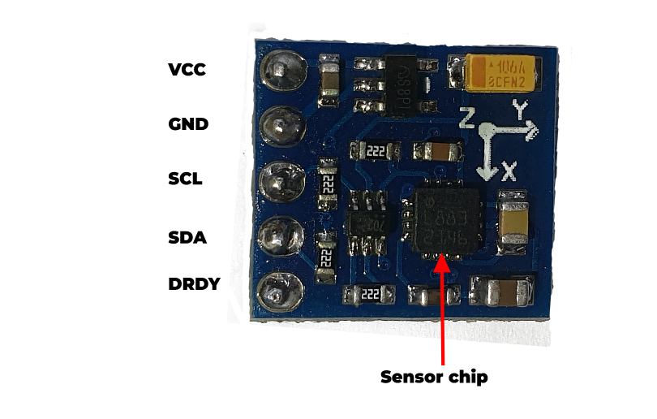

# GY-271 Compass Magnetometer Setup


This repository contains code and instructions for setting up the GY-271 compass magnetometer module with an Arduino microcontroller. The code provided enables you to read and interpret magnetic field data from the GY-271 module, allowing you to use it as a compass or for other applications that require magnetometer functionality. To get a more comprehensive guide on how to set up the module, please refer to our article on **Find Your Way With a GY-271 Compass Module and Arduino**

## Features

- **Easy setup:** The code provides a simple and straightforward way to interface the GY-271 compass magnetometer module with an Arduino microcontroller.
- **Read magnetic field data:** You can use the code to read magnetic field data from the GY-271 module in three axes (X, Y, and Z), providing information about the magnetic field strength and direction.
- **Calibration support:** The code includes optional calibration routines that can help you calibrate the GY-271 module for accurate readings in your specific environment.
- **Customizable:** The code includes placeholders for you to fill in with your own details, such as calibration parameters, making it easy to customize for your specific use case.

## Getting Started

To use this code with your GY-271 magnetometer module and Arduino, follow these steps:

1. **Connect the GY-271 module:** You may need to refer to our article for the pinout diagram, library installation guide and steps to wire the module to an Arduino board.

2. **Upload the code:** Upload the provided code to your Arduino microcontroller using the Arduino IDE.

3. **Configure the code:** Open the code in your preferred text editor and fill in the necessary details, such as calibration parameters (if desired), and any other configuration options specified in the code. Make sure to save the changes.

4. **Upload the code:** Upload the modified code to your Arduino microcontroller.

5. **Run the code:** Once the code is uploaded, your Arduino microcontroller will start reading magnetic field data from the GY-271 module, printing it to the serial monitor. You can now use the functions in the code to access the magnetic field data and use it for your desired application.

## Example Usage

Here's an example of how you can use the functions in the code to read magnetic field data:

```cpp
// Read magnetic field data
int16_t x = readMagneticFieldX();
int16_t y = readMagneticFieldY();
int16_t z = readMagneticFieldZ();

// Convert raw data to magnetic field strength in Gauss
float magneticFieldX = x * 0.92 / 1000.0; // Replace 0.92 with your specific calibration factor
float magneticFieldY = y * 0.92 / 1000.0; // Replace 0.92 with your specific calibration factor
float magneticFieldZ = z * 0.92 / 1000.0; // Replace 0.92 with your specific calibration factor

// Use the magnetic field data for your specific application
// e.g., calculate compass heading, detect magnetic anomalies, etc.
```
## Troubleshooting

If you encounter any issues with setting up or using the GY-271 compass magnetometer, here are some troubleshooting tips:

- **Check connections:** Double-check the connections between the GY-271 module and your Arduino microcontroller. Ensure that all wires are properly connected and in the correct pins as specified in the article.

- **Verify calibration:** If you have performed calibration on the GY-271 module, make sure that you have entered the correct calibration factors (declination angle) in the code. Incorrect calibration factors can result in inaccurate magnetic field readings.

- **Check power supply:** Make sure that the GY-271 module is properly powered according to its specifications. Insufficient or unstable power supply can cause erratic behavior or incorrect readings.

- **Serial monitor:** Use the Serial monitor in your Arduino IDE to monitor the output from the GY-271 module. This can help you identify any issues with data reading or processing. Also, make sure that you have set the right baud rate to get sensible readings.

- **Consult documentation:** Refer to the documentation provided with your GY-271 module and Arduino board for troubleshooting guidance specific to your hardware.

If you have any questions, issues, or contributions, feel free to raise them on the GitHub repository. Happy magnetometer tinkering!

## License

This code is open source and available under the [MIT License](LICENSE).

---

**Note:** This README assumes basic familiarity with Arduino programming and magnetometer concepts.
